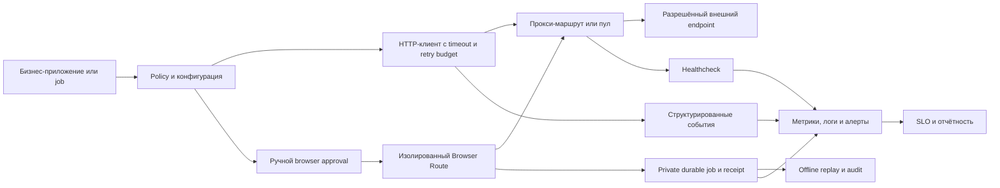

# Референсная архитектура B2B-прокси-контура

## Компоненты

### Policy и конфигурация

Хранит разрешённые цели, тип маршрута, регион, timeout, retry budget, лимит параллелизма и владельца бизнес-сценария. Секреты хранятся отдельно.

### Production HTTP-клиент

Отвечает за безопасную сборку proxy URL, timeout, повторные попытки, категоризацию ошибок и структурированный результат. Он не должен принимать решение о допустимости бизнес-сценария.

### Policy-gated Browser Route

Используется только после явного approval, когда HTTP route не даёт требуемого
разрешённого результата. Browser context изолирован, target и subresources
проходят exact allowlist, методы и request budget ограничены. Каждый запуск
создаёт приватный durable job, report и SHA-256 receipt для offline replay.

### Healthcheck

Проверяет каждый маршрут на заранее согласованных контрольных endpoints и формирует машинно-читаемый отчёт. Проверка не должна использовать реальные клиентские данные.

### Наблюдаемость

Метрики и логи должны позволять отличить:

- ошибку приложения;
- ошибку proxy authentication;
- недоступность маршрута;
- timeout целевого endpoint;
- деградацию latency;
- исчерпание retry budget.

Credentials и полный proxy URL не должны попадать в метрики, логи, tracing или отчёты.

## Граница ответственности

| Слой | Отвечает за |
|---|---|
| Бизнес-владелец | Законность, назначение, целевые ресурсы и критерии результата |
| Platform/DevOps | Секреты, доступность, лимиты, мониторинг и инциденты |
| Разработчики | Корректные timeout, retry, идемпотентность и обработку ошибок |
| Security/Legal | Политики доступа, договорные и регуляторные требования |

## Базовая последовательность внедрения

1. Зафиксировать разрешённый сценарий и владельца.
2. Проверить маршрут инструментом уровня 1.
3. Подключить production-клиент уровня 2.
4. Ввести health checks и SLO уровня 3.
5. Только затем увеличивать параллелизм и объём.
